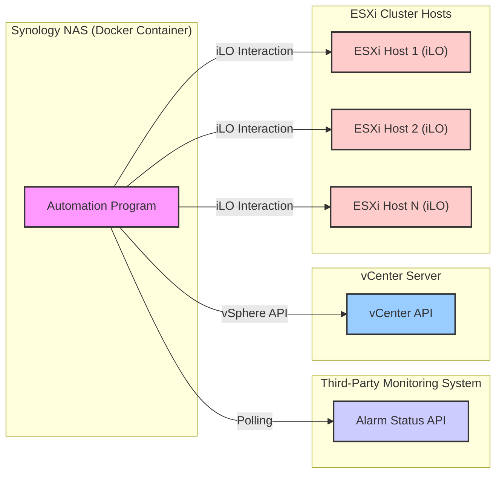

# Thermo-Guard

Thermo-Guard is an automated system that monitors temperature alarms from a third-party monitoring solution (Cisco Meraki) and manages an ESXi cluster accordingly. When a high-temperature alarm is detected, Thermo-Guard automatically initiates a controlled shutdown of the ESXi cluster. Once the temperature returns to normal, it powers the cluster back on via iLO interfaces.

## Features

- **Automated Temperature Monitoring**: Polls Cisco Meraki API to check temperature status
- **Controlled ESXi Cluster Shutdown**: Gracefully shuts down VMs and hosts when high temperature is detected
- **Automated Power-On**: Powers on ESXi hosts via iLO when temperature returns to normal
- **Dockerized Solution**: Runs in a Docker container on Synology NAS
- **Secure Credential Management**: Handles vCenter and iLO credentials securely
- **Comprehensive Logging**: Logs all operations and errors for monitoring

## Architecture

Thermo-Guard runs as a Docker container on a Synology NAS, polling the Meraki API for temperature alerts. When a high-temperature condition is detected, it connects to vCenter to orchestrate a controlled shutdown of the ESXi cluster. When temperatures return to normal, it uses iLO interfaces to power the hosts back on.



## Prerequisites

- Python 3.12 or higher
- Docker environment (for containerized deployment)
- Synology NAS with Container Manager (formerly Docker)
- Cisco Meraki environment with API access
- vCenter Server managing the ESXi cluster
- ESXi hosts with accessible iLO interfaces
- Network connectivity between the Synology NAS and all components

## Installation

### Clone the repository

```bash
git clone https://github.com/yourusername/thermo-guard.git
cd thermo-guard
```

### Install dependencies

```bash
pip install -e .
```

Or install directly from requirements:

```bash
pip install -r requirements.txt
```

## Configuration

Thermo-Guard is configured using environment variables. You can set these directly or use a `.env` file:

### Required Environment Variables

```
# Meraki API Configuration
MERAKI_API_KEY=your_meraki_api_key
MERAKI_NETWORK_ID=your_meraki_network_id
MERAKI_API_BASE_URL=https://api.meraki.com/api/v1
MERAKI_POLLING_INTERVAL=60

# Temperature Thresholds
TEMPERATURE_HIGH_THRESHOLD=35
TEMPERATURE_LOW_THRESHOLD=30

# vCenter Configuration
VCENTER_HOST=vcenter_hostname_or_ip
VCENTER_USER=vcenter_username
VCENTER_PASSWORD=vcenter_password

# iLO Configuration (JSON format)
ILO_HOSTS=[{"host":"ilo1_ip","username":"ilo1_user","password":"ilo1_pass"},{"host":"ilo2_ip","username":"ilo2_user","password":"ilo2_pass"}]
```

## Usage

### Running Locally

```bash
python -m thermo_guard.main
```

Or using the installed entry point:

```bash
thermo-guard
```

### Docker Deployment

Build the Docker image:

```bash
docker build -t thermo-guard .
```

Run the container:

```bash
docker run -d --name thermo-guard \
  --restart unless-stopped \
  --env-file .env \
  thermo-guard
```

### Synology NAS Deployment

1. Build the Docker image as shown above or pull it from your Docker registry
2. Open Synology DSM and navigate to Container Manager
3. Register the image and create a container
4. Configure environment variables in the container settings
5. Start the container

## How It Works

1. The application polls the Meraki API at regular intervals to check temperature status
2. If temperature exceeds the high threshold:
   - All VMs in the ESXi cluster are gracefully shut down
   - ESXi hosts are put into maintenance mode
   - ESXi hosts are shut down
3. If temperature falls below the low threshold:
   - All ESXi hosts are powered on via their iLO interfaces
4. All actions are logged for monitoring and troubleshooting

## Error Handling

Thermo-Guard implements robust error handling:
- Retry mechanisms with exponential backoff for API communication
- Graceful handling of partial failures
- Comprehensive logging of all errors and operations

## License

This project is licensed under the MIT License - see the LICENSE file for details.

## Author

BoHong Li (a60814billy@gmail.com)
