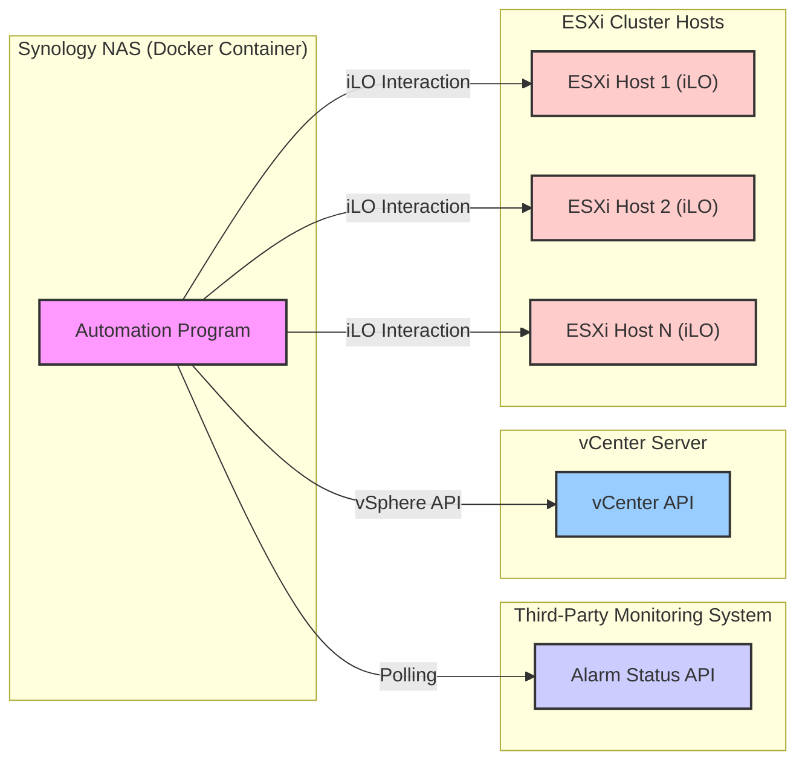

# 基於溫度警報的 ESXi 叢集自動關機及開機（使用 Docker 部署在 Synology NAT 上並採用輪詢機制）

## 1. 目標

當第三方監控系統偵測到高溫警報時，自動關閉由 vCenter 管理的 ESXi 叢集，並在警報解除後自動重新開機。自動化程式將在 Synology NAS 背後的 NAT 環境中的 Docker 容器內執行，並使用輪詢方式檢查警報狀態。

## 2. 架構

## 3. 需求

### 3.1. 監控系統整合

* **警報狀態 API：** 第三方監控系統必須提供可供輪詢的 API 端點，用於擷取目前溫度警報狀態。
* **警報識別：** API 回應必須清楚指出高溫警報是否啟動或已解除。回應應包含用於識別特定警報的相關資訊。
* **輪詢間隔：** 自動化程式將定期輪詢監控系統的 API。輪詢間隔應可設定。

### 3.2. Synology NAS 上的 Docker 容器

* **Docker 映像檔：** 建立包含必要程式的 Docker 映像檔（例如：附帶所需函式庫的 Python 腳本）。
* **Synology 容器管理器：** 使用 Synology 的容器管理器（原先為 Docker）部署及管理 Docker 容器。
* **網路（NAT）：** Docker 容器將部署在 Synology NAS 的 NAT 背後。確保容器可存取監控系統的 API 和 vCenter 伺服器。
* **資源分配：** 為 Docker 容器分配足夠的 CPU 和記憶體資源，以確保可靠運作。
* **持久化（選擇性但建議）：** 考慮使用磁碟區來保存容器外的設定或日誌。

### 3.3. vCenter 互動

* **vCenter 連線：** Docker 容器內的程式必須能使用 vSphere API 連線至 vCenter 伺服器（例如：使用 Python 的 `pyvmomi`）。
* **憑證管理：** 必須安全管理 vCenter 伺服器憑證（使用者名稱和密碼）（例如：環境變數、Synology 密鑰）。
* **受控關機：** 偵測到高溫警報時，程式將執行受控關機 ESXi 叢集：
    * 優雅關閉每台主機上的所有虛擬機器（盡可能使用 VMware Tools，否則強制關機）。
    * 將每台 ESXi 主機置於維護模式。
    * 關閉每台 ESXi 主機。

### 3.4. 透過 iLO 互動以開機

* **iLO 連線：** Docker 容器內的程式必須能透過網路與每台 ESXi 主機的 iLO 介面通訊。
* **iLO 憑證管理：** 必須安全管理 iLO 憑證（每台主機的 IP 位址、使用者名稱、密碼）（例如：環境變數、Synology 密鑰）。
* **開機指令：** 偵測到溫度警報已解除時，程式將透過各 ESXi 主機的 iLO 介面發送開機指令（例如：使用 `python-ilorest-library` 進行 HPE iLO 或其他廠商的類似工具）。

### 3.5. 設定

* **監控 API 端點：** 可設定監控系統警報狀態 API 的 URL。
* **輪詢間隔：** 可設定輪詢監控 API 的時間間隔（以秒為單位）。
* **警報啟動準則：** 可在 API 回應中設定識別啟動高溫警報的準則。
* **警報解除準則：** 可在 API 回應中設定識別高溫警報已解除的準則。
* **vCenter 伺服器詳細資料：** 可設定主機名稱/IP 位址、使用者名稱和密碼。
* **ESXi 主機 iLO 詳細資料：** 可設定每台 ESXi 叢集主機的 iLO 介面 IP 位址、使用者名稱和密碼。
* **關機順序（隱含）：** 程式應逐一遍歷主機以關閉虛擬機器，再關閉主機本身。開機順序可能較不重要，但可以考慮。

### 3.6. 日誌和監控

* **容器日誌：** 程式應產生可透過 Synology 容器管理器存取的日誌。日誌應包含：
    * 輪詢嘗試和結果。
    * 警報狀態變更。
    * vCenter 連線嘗試和動作（虛擬機器關機、維護模式、主機關機）。
    * iLO 連線嘗試和開機指令。
    * 各步驟遇到的錯誤。

### 3.7. 安全性

* **憑證安全：** 所有敏感憑證（vCenter、iLO、監控 API 如適用）必須安全儲存，不得硬編碼在程式中。考慮使用 Synology 的內建密鑰管理或具有受限存取權的環境變數。
* **網路安全：** 確保 Synology NAS、監控系統、vCenter 伺服器和 ESXi iLO 介面之間的網路存取適當受限。必要時考慮防火牆規則。

### 3.8. 錯誤處理和復原

* **API 錯誤：** 為與監控 API 通訊失敗實作錯誤處理。考慮具有退避策略的重試機制。
* **vCenter 錯誤：** 為 vCenter 連線失敗和 API 呼叫錯誤實作錯誤處理。
* **iLO 錯誤：** 為 iLO 連線失敗和指令執行錯誤實作錯誤處理。
* **部分失敗：** 程式應嘗試優雅處理部分失敗（例如，若部分主機無法關機或開機）。日誌應清楚指出此類失敗。

## 4. 排除範圍

* ESXi 叢集、vCenter 伺服器和第三方監控系統的初始設定。
* Synology NAS 和 Docker 環境的設定。
* 輪詢機制和 API 解析的詳細實作細節（這些將取決於所選程式語言和監控系統的 API）。
* 自動關機或開機失敗時的手動干預流程。

## 5. 成功標準

* 在 Synology NAS 上執行的 Docker 容器程式成功輪詢第三方監控系統的溫度警報狀態。
* 偵測到高溫警報時，程式透過 vCenter 對 ESXi 叢集啟動受控關機。
* 偵測到警報解除時，程式透過 iLO 介面啟動 ESXi 主機開機。
* 所有動作均適當記錄。
* 敏感憑證經安全管理。
