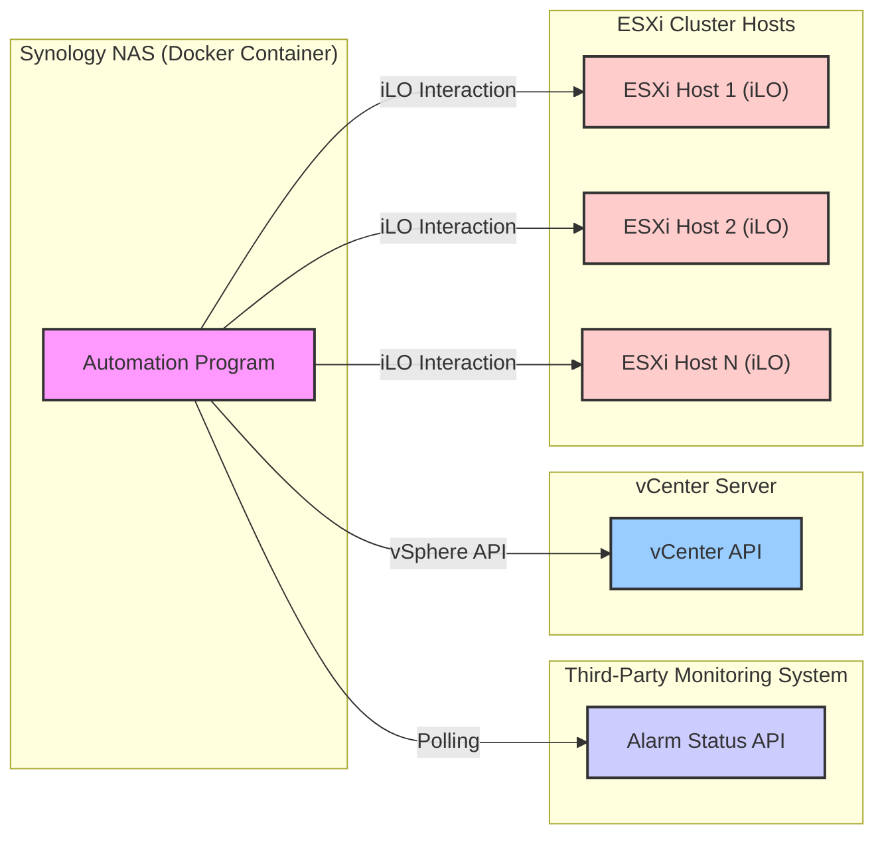

# Automated ESXi Cluster Shutdown and Power-On based on Temperature Alarm (Dockerized on Synology NAT with Polling)

## 1. Goal

To automatically shut down an ESXi cluster (managed by vCenter) when a high-temperature alarm is detected by a third-party monitoring solution and automatically power it back on when the alarm recovers. The automation program will run in a Docker container hosted on a Synology NAS behind a NAT configuration, using polling to check the alarm status.

## 2. Architecture

## 3. Requirements

### 3.1. Monitoring System Integration

* **Alarm Status API:** The third-party monitoring system must provide an API endpoint that can be polled to retrieve the current status of the temperature alarm.
* **Alarm Identification:** The API response must clearly indicate whether a high-temperature alarm is active or has recovered. The response should include relevant information to identify the specific alarm.
* **Polling Interval:** The automation program will periodically poll the monitoring system's API. The polling interval should be configurable.

### 3.2. Docker Container on Synology NAS

* **Docker Image:** A Docker image will be created containing the necessary program (e.g., Python script with required libraries).
* **Synology Container Manager:** The Docker container will be deployed and managed using Synology's Container Manager (formerly Docker).
* **Networking (NAT):** The Docker container will be hosted behind the Synology NAS's NAT. Ensure the container has network access to the monitoring system's API and the vCenter Server.
* **Resource Allocation:** Sufficient CPU and memory resources should be allocated to the Docker container for reliable operation.
* **Persistence (Optional but Recommended):** Consider using volumes to persist configuration or logs outside the container.

### 3.3. vCenter Interaction

* **vCenter Connectivity:** The program within the Docker container must be able to connect to the vCenter Server using the vSphere API (e.g., via `pyvmomi` for Python).
* **Credentials Management:** vCenter Server credentials (username and password) must be securely managed (e.g., environment variables, Synology Secrets).
* **Controlled Shutdown:** Upon detecting a high-temperature alarm, the program will initiate a controlled shutdown of the ESXi cluster:
    * Gracefully shut down all virtual machines on each host (using VMware Tools if possible, otherwise force power off).
    * Place each ESXi host into maintenance mode.
    * Shut down each ESXi host.

### 3.4. iLO Interaction for Power-On

* **iLO Connectivity:** The program within the Docker container must be able to communicate with the iLO interface of each ESXi host over the network.
* **iLO Credentials Management:** iLO credentials (IP address, username, password for each host) must be securely managed (e.g., environment variables, Synology Secrets).
* **Power-On Command:** Upon detecting that the temperature alarm has recovered, the program will send the power-on command to each ESXi host via their iLO interface (e.g., using `python-ilorest-library` for HPE iLO or similar tools for other vendors).

### 3.5. Configuration

* **Monitoring API Endpoint:** Configurable URL for the monitoring system's alarm status API.
* **Polling Interval:** Configurable time interval (in seconds) for polling the monitoring API.
* **Alarm Active Criteria:** Configurable criteria within the API response to identify an active high-temperature alarm.
* **Alarm Recovered Criteria:** Configurable criteria within the API response to identify that the high-temperature alarm has recovered.
* **vCenter Server Details:** Configurable hostname/IP address, username, and password for the vCenter Server.
* **ESXi Host iLO Details:** Configurable IP address, username, and password for the iLO interface of each ESXi host in the cluster.
* **Shutdown Order (Implicit):** The program should iterate through hosts to shut down VMs and then the hosts themselves. Power-on order might be less critical but can be considered.

### 3.6. Logging and Monitoring

* **Container Logging:** The program should generate logs that are accessible through the Synology Container Manager. Logs should include information about:
    * Polling attempts and results.
    * Alarm status changes.
    * vCenter connection attempts and actions (VM shutdown, maintenance mode, host shutdown).
    * iLO connection attempts and power-on commands.
    * Errors encountered during any step.

### 3.7. Security

* **Credential Security:** All sensitive credentials (vCenter, iLO, monitoring API if applicable) must be stored securely and not hardcoded in the program. Consider using Synology's built-in secrets management or environment variables with restricted access.
* **Network Security:** Ensure network access is appropriately restricted between the Synology NAS, monitoring system, vCenter Server, and ESXi iLO interfaces. Consider firewall rules if necessary.

### 3.8. Error Handling and Recovery

* **API Errors:** Implement error handling for communication failures with the monitoring API. Consider retry mechanisms with backoff.
* **vCenter Errors:** Implement error handling for vCenter connection failures and API call errors.
* **iLO Errors:** Implement error handling for iLO connection failures and command execution errors.
* **Partial Failure:** The program should attempt to handle partial failures gracefully (e.g., if some hosts fail to shut down or power on). Logging should clearly indicate such failures.

## 4. Out of Scope

* Initial setup and configuration of the ESXi cluster, vCenter Server, and the third-party monitoring system.
* Configuration of the Synology NAS and Docker environment.
* Detailed implementation specifics of the polling mechanism and API parsing (these will depend on the chosen programming language and the monitoring system's API).
* Manual intervention processes if the automated shutdown or power-on fails.

## 5. Success Criteria

* The program running in the Docker container on the Synology NAS successfully polls the third-party monitoring system for temperature alarm status.
* Upon detection of a high-temperature alarm, the program initiates a controlled shutdown of the ESXi cluster via vCenter.
* Upon detection of the alarm recovery, the program initiates the power-on of the ESXi hosts via their iLO interfaces.
* All actions are logged appropriately.
* Sensitive credentials are managed securely.